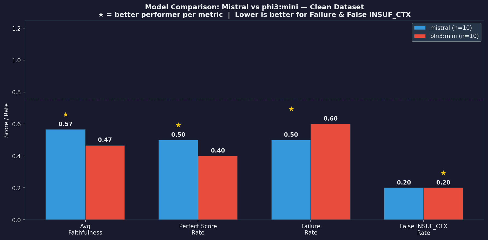
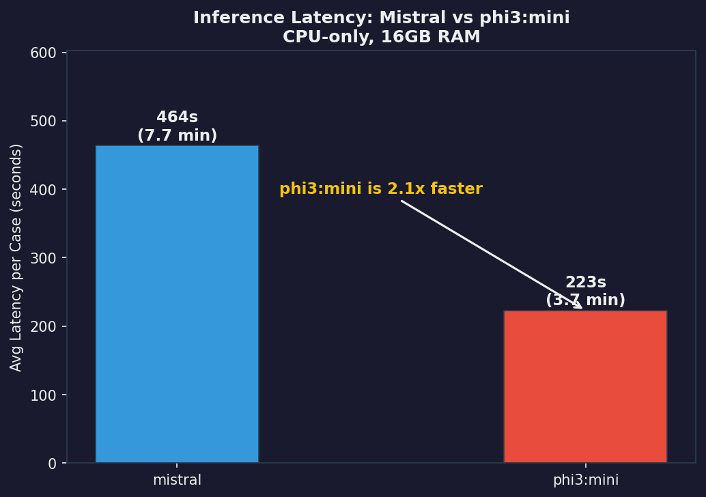

# LLM Evaluation Framework
### Faithfulness & Consistency Evaluation for Document-Grounded QA

---

## What This Is

A framework for evaluating whether LLM answers to document-based questions are actually grounded in the provided context — or just *look* correct because the model has seen similar data during training.

This is not a benchmark. This is a tool for exposing specific failure modes.

**Four dimensions evaluated:**

| Dimension | Question Asked |
|-----------|---------------|
| **Faithfulness** | Can every claim in the answer be traced back to the source document? |
| **Consistency** | Does the answer remain stable when the question is paraphrased? |
| **Retrieval Dependency** | Does the answer change when the context is removed or replaced? |
| **Sensitivity** | How much does a small prompt perturbation affect the output? |

---

## Design Principles

**No LLM judge.** Faithfulness is measured by tracing each extracted claim to an evidence span using semantic similarity — not by asking another model to evaluate the answer. Circular logic is not evaluation.

**No opaque scores.** Every metric can be explained logically. Every failure case is documented with a diagnosis, not just flagged.

**Config-driven.** All thresholds and parameters live in `config.yaml` — no magic numbers buried in code. Recalibration for a new domain means editing one file.

**Failure cases are first-class citizens.** The `reports/analysis.md` documents what went wrong and why — not just aggregate scores.

**Fully local, fully free.** All inference runs via [Ollama](https://ollama.ai). No OpenAI API, no GPU required.

---

## Stack

| Component | Tool |
|-----------|------|
| LLM inference | Ollama (mistral, phi3:mini) |
| Embeddings | nomic-embed-text via Ollama |
| Similarity | Cosine similarity (numpy) |
| Lexical overlap | ROUGE-L (rouge-score) |
| Config | PyYAML |
| Reporting | Jinja2 + Matplotlib |
| Dataset | FastAPI documentation (manually curated) |

---

## Project Structure

```
llm-eval-framework/
│
├── data/
│   ├── raw/                          # FastAPI docs source sections
│   └── dataset/
│       ├── clean_cases.json          # 10 baseline QA pairs
│       ├── distractor_cases.json     # 5 cases with modified context
│       └── paraphrase_cases.json     # 6 cases with rephrased questions
│
├── evaluators/
│   ├── faithfulness.py               # Claim extraction + evidence matching (v1.2.1)
│   ├── consistency.py                # Cross-variant answer comparison (v1.0.0)
│   ├── retrieval_dependency.py       # Context manipulation detection (v1.0.0)
│   └── sensitivity.py               # Prompt perturbation robustness (v1.0.0)
│
├── pipeline/
│   ├── runner.py                     # Main orchestrator — resume, retry, dry-run
│   ├── config_loader.py              # Singleton config loader (reads config.yaml)
│   ├── model_client.py               # Ollama wrapper (model-agnostic)
│   └── prompt_templates.py           # All prompts centralized here
│
├── reports/
│   ├── results/                      # JSON outputs (auto-generated, gitignored)
│   ├── charts/                       # PNG visualizations (gitignored)
│   ├── templates/
│   │   └── report.html.j2            # Jinja2 HTML report template
│   ├── visualize.py                  # Chart generator (--chart flag)
│   ├── generate_report.py            # HTML report generator (--embed-charts flag)
│   └── analysis.md                   # Observations and failure cases (real data)
│
├── tests/
│   ├── test_faithfulness.py          # 26 tests — core evaluator
│   ├── test_phase1_features.py       # 52 tests — Phase 1 features
│   ├── test_consistency.py           # Consistency evaluator
│   ├── test_model_client.py          # Ollama client
│   └── test_sensitivity.py           # Sensitivity evaluator
│                                     # Total: 157 tests, no Ollama required
│
├── logs/                             # Background run logs + checkpoints
├── config.yaml                       # All thresholds and parameters
├── .github/workflows/test.yml        # CI — auto-run on every push
├── requirements.txt
└── README.md
```

---

## Setup

**1. Install Ollama**
```bash
curl -fsSL https://ollama.ai/install.sh | sh

ollama pull mistral
ollama pull phi3:mini
ollama pull nomic-embed-text
```

**2. Install Python dependencies**
```bash
pip install -r requirements.txt
```

**3. Download NLTK data (once)**
```bash
python -c "import nltk; nltk.download('punkt'); nltk.download('punkt_tab')"
```

---

## Usage

**Smoke test evaluators — no LLM required**
```bash
python -m evaluators.faithfulness
python -m evaluators.consistency
python -m evaluators.sensitivity
```

**Validate dataset without inference**
```bash
python pipeline/runner.py --model phi3:mini --dataset clean --dry-run
```

**Run faithfulness evaluation**
```bash
# Development (1 case, fast)
python pipeline/runner.py --model phi3:mini --dataset clean --limit 1

# Full eval — resumes automatically if crashed
python pipeline/runner.py --model mistral --dataset clean
python pipeline/runner.py --model mistral --dataset distractor

# Force re-run (ignore existing checkpoints)
python pipeline/runner.py --model mistral --dataset clean --no-resume

# Background process
nohup python pipeline/runner.py --model mistral --dataset clean > logs/run.log 2>&1 &
```

**Run tests**
```bash
pytest tests/ -v
# Expected: 157 passed
```

**Generate charts**
```bash
python reports/visualize.py                      # all charts
python reports/visualize.py --chart model_comparison
python reports/visualize.py --chart per_case
python reports/visualize.py --chart latency
```

**Generate HTML report**
```bash
# Relative paths (requires charts folder)
python reports/generate_report.py

# Self-contained single file — charts embedded as base64
python reports/generate_report.py --embed-charts --output reports/report.html
```

---

## Configuration

All thresholds live in `config.yaml` at the project root:

```yaml
thresholds:
  faithfulness_evidence: 0.75        # claim must match context span
  insufficient_ctx_validation: 0.65  # ground truth vs context similarity
  consistency_semantic: 0.72         # cross-variant semantic agreement
  consistency_rouge_l: 0.40          # lexical overlap floor
  robustness_sensitivity: 0.85       # perturbation stability threshold
  short_answer_max_words: 5          # route to exact match path
  short_answer_char_sim: 0.85        # char similarity fallback

inference:
  timeout_seconds: 900
  max_retries: 3
  retry_backoff_base: 2

pipeline:
  checkpoint_dir: "logs/checkpoints"

technical_term_groups:               # terms that must not be confused
  - ["put", "patch", "post", "get", "delete"]
  - ["200", "201", "204", "400", "401", "403", "404", "422", "500"]
  - ["true", "false"]
  - ["sync", "async", "await"]
```

---

## Dataset Design

Three case types, each targeting a different failure mode:

**Clean cases** (`clean_cases.json`) — The answer exists explicitly in the context. Baseline evaluation. If a model fails here, the discussion ends.

**Distractor cases** (`distractor_cases.json`) — Context is intentionally modified: values swapped, critical information removed, or contradictory information inserted. A model that answers confidently despite a corrupted context is a model that cannot be trusted.

**Paraphrase cases** (`paraphrase_cases.json`) — Same question, different formulation. A model whose answer shifts based on how the question is worded is not reliable for production use.

---

## Faithfulness Metric

```
Faithfulness = Supported Claims / Total Claims

where:
  Supported Claim   = claim with cosine similarity ≥ 0.75 to any context span
  Unsupported Claim = claim with no sufficient evidence in context

Special cases:
  Short answer (< 5 words) → exact match path (exact → substring → char sim)
  Fixes blind spot for single-token answers like HTTP methods ("PUT") or
  file paths ("/files/myfile.txt") where embedding similarity is unreliable.

  Technical conflict override → if claim and evidence use different terms
  from the same group (e.g. PUT vs PATCH), similarity is zeroed regardless
  of embedding score. Prevents high topical similarity masking factual error.
```

---

## Evaluation Results

### Mistral vs phi3:mini — Clean Dataset

| Metric | Mistral | phi3:mini |
|--------|---------|-----------|
| Avg faithfulness | **56.7%** | 46.7% |
| Perfect score (1.0) | 5/10 | 4/10 |
| Failure rate | 50% | 60% |
| False INSUFFICIENT_CTX | 2 | 2 |
| Avg latency per case | 463.7s | **222.9s** |
| Total eval time | 160 min | 77.7 min |

**Mistral is more faithful. phi3:mini is 2.1x faster.** Both models over-trigger INSUFFICIENT_CONTEXT at the same rate — a prompt design issue, not a model-specific one.

### Mistral — Clean vs Distractor Dataset

| Dataset | Avg Faithfulness | Notes |
|---------|-----------------|-------|
| Clean | 56.7% | Normal context |
| Distractor | **8.3%** | Manipulated context |

Drop from 56.7% → 8.3% confirms: **Mistral follows whatever context it receives — including wrong context.** Garbage in, garbage out.

---

## Charts

**Model Comparison — Mistral vs phi3:mini**


**Per-Case Faithfulness — Mistral vs phi3:mini**


**Faithfulness per case — Clean Dataset**


**Faithfulness per case — Distractor Dataset**


**Clean vs Distractor Comparison**


**Inference Latency**


---

## Key Findings

See [`reports/analysis.md`](reports/analysis.md) for full analysis with raw data. Summary:

1. **False INSUFFICIENT_CONTEXT** — Model refused to answer despite explicit evidence (similarity: 0.7249 and 0.9691). Detected via two-stage validation with separate threshold (0.65).

2. **Claim granularity matters** — Evaluating a sentence with 5 items as one claim produces false positives. `_expand_enumeration()` fixes this, changing score 1.0 → 0.6 for the same answer.

3. **Semantic ≠ Factual** — PUT vs PATCH yields similarity 0.8337 despite being factually different. Technical conflict detection overrides embedding score for terms in the same group.

4. **Embedding limitation** — nomic-embed-text treats semantically identical paraphrases as different (similarity: 0.7677). Threshold empirically calibrated to 0.72 for consistency evaluation.

5. **Short answer blind spot** — Fixed in v1.2.1. Single-word answers use exact match path instead of semantic similarity.

6. **Context-faithful is double-edged** — Distractor dataset proves Mistral follows whatever context it receives. Retrieval quality fully determines answer quality.

---

## Reproducing Results

```
Hardware : 16GB RAM, no GPU (CPU-only)
Models   : mistral (eval), phi3:mini (dev), nomic-embed-text (embeddings)
Latency  : 4-8 minutes per query on CPU
Eval time: ~80-160 minutes for 10 cases depending on model
Checkpoints auto-saved per case — safe to interrupt and resume.
```

This is a deliberate tradeoff — reproducibility over speed. Anyone with 16GB RAM can reproduce all results without a GPU or paid API.

---

## What This Is Not

- Not a general-purpose LLM benchmark
- Not a replacement for human evaluation
- Not a claim about which model is "better"

It is a reusable framework for asking specific, verifiable questions about LLM behavior in document-grounded QA settings.

---

## License

MIT