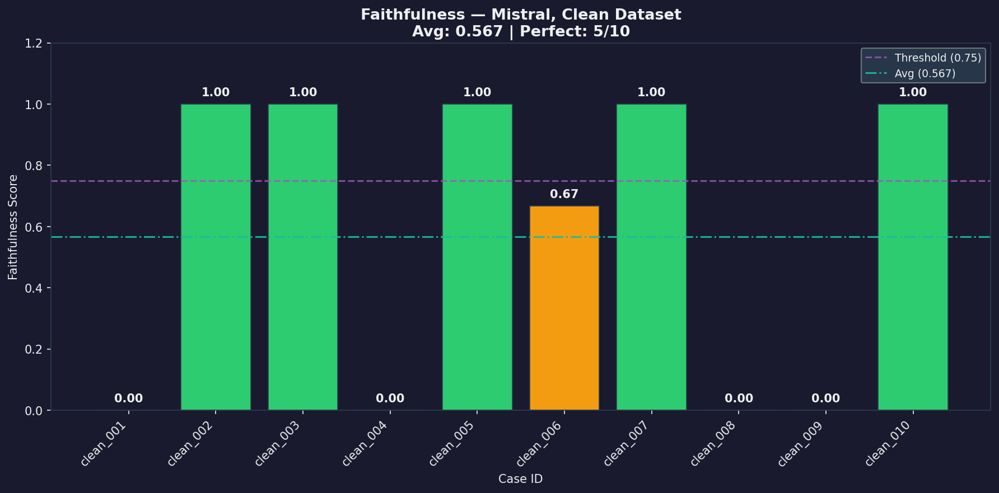
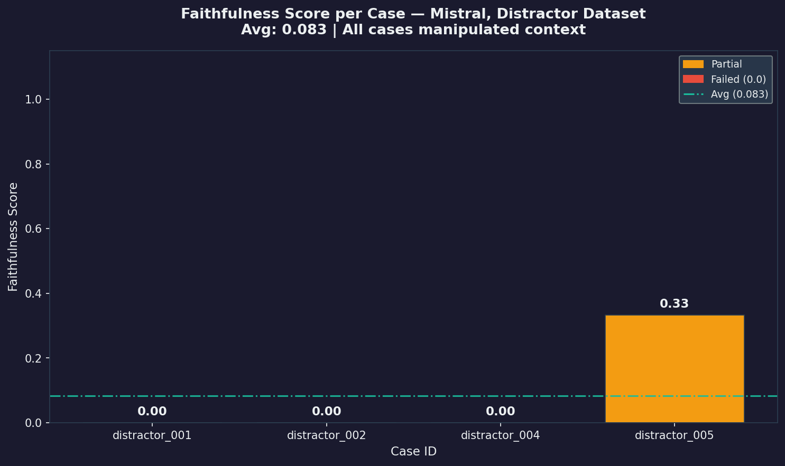
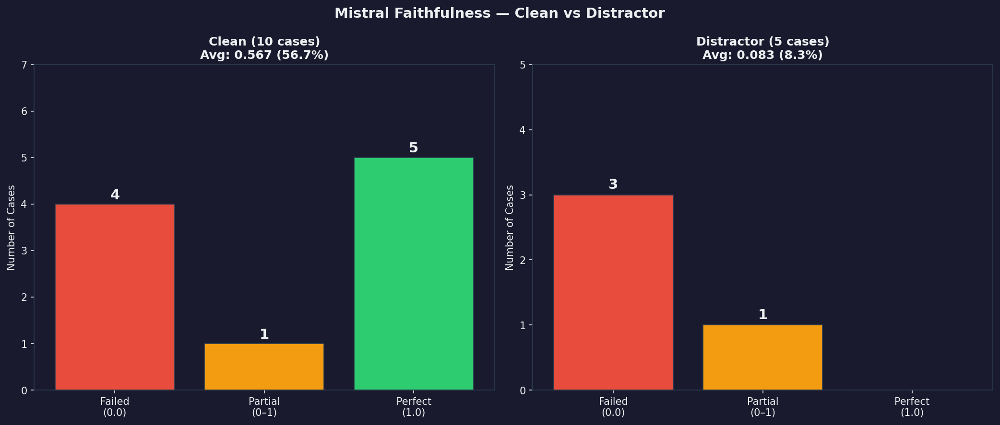

# LLM Evaluation Framework
### Faithfulness & Consistency Evaluation for Document-Grounded QA

---

## What This Is

A framework for evaluating whether LLM answers to document-based questions are actually grounded in the provided context — or just *look* correct because the model has seen similar data during training.

This is not a benchmark. This is a tool for exposing specific failure modes.

**Four dimensions evaluated:**

| Dimension | Question Asked |
|-----------|---------------|
| **Faithfulness** | Can every claim in the answer be traced back to the source document? |
| **Consistency** | Does the answer remain stable when the question is paraphrased? |
| **Retrieval Dependency** | Does the answer change when the context is removed or replaced? |
| **Sensitivity** | How much does small perturbation in prompt affect the output? |

---

## Design Principles

**No LLM judge.** Faithfulness is measured by tracing each extracted claim to an evidence span using semantic similarity — not by asking another model to evaluate the answer. Circular logic is not evaluation.

**No opaque scores.** Every metric can be explained logically. Every failure case is documented with a diagnosis, not just flagged.

**Failure cases are first-class citizens.** The `reports/analysis.md` documents what went wrong and why — not just aggregate scores.

**Fully local, fully free.** All inference runs via [Ollama](https://ollama.ai). No OpenAI API, no GPU required.

---

## Stack

| Component | Tool |
|-----------|------|
| LLM inference | Ollama (mistral, phi3:mini) |
| Embeddings | nomic-embed-text via Ollama |
| Similarity | Cosine similarity (numpy) |
| Lexical overlap | ROUGE-L (rouge-score) |
| Dataset | FastAPI documentation (manually curated) |

---

## Project Structure

```
llm-eval-framework/
│
├── data/
│   ├── raw/                          # FastAPI docs source sections
│   └── dataset/
│       ├── clean_cases.json          # 10 baseline QA pairs
│       ├── distractor_cases.json     # 5 cases with modified context
│       └── paraphrase_cases.json     # 6 cases with rephrased questions
│
├── evaluators/
│   ├── faithfulness.py               # Claim extraction + evidence matching
│   ├── consistency.py                # Cross-variant answer comparison
│   ├── retrieval_dependency.py       # Context manipulation detection
│   └── sensitivity.py               # Prompt perturbation analysis
│
├── pipeline/
│   ├── runner.py                     # Main orchestrator
│   ├── model_client.py               # Ollama wrapper (model-agnostic)
│   └── prompt_templates.py           # All prompts centralized here
│
├── reports/
│   ├── results/                      # JSON outputs (auto-generated)
│   └── analysis.md                   # Observations and failure cases
│
├── tests/                            # Unit tests (no Ollama required)
├── requirements.txt
└── README.md
```

---

## Setup

**1. Install Ollama**
```bash
# Linux/Mac
curl -fsSL https://ollama.ai/install.sh | sh

# Pull models
ollama pull mistral
ollama pull nomic-embed-text
```

**2. Install Python dependencies**
```bash
pip install -r requirements.txt
```

**3. Download NLTK data (once)**
```bash
python -c "import nltk; nltk.download('punkt'); nltk.download('punkt_tab')"
```

---

## Usage

**Run faithfulness evaluation — development mode (fast, 1 case)**
```bash
python pipeline/runner.py --model phi3:mini --dataset clean --limit 1
```

**Run faithfulness evaluation — full dataset**
```bash
python pipeline/runner.py --model mistral --dataset clean
```

**Run distractor cases (retrieval dependency)**
```bash
python pipeline/runner.py --model mistral --dataset distractor
```

**Run all datasets**
```bash
python pipeline/runner.py --model mistral --dataset all
```

**Smoke test individual evaluators (no LLM required)**
```bash
python -m evaluators.faithfulness
python -m evaluators.consistency
python -m evaluators.retrieval_dependency
```

---

## Dataset Design

Three case types, each targeting a different failure mode:

**Clean cases** (`clean_cases.json`) — The answer exists explicitly in the context. Baseline evaluation. If a model fails here, the discussion ends.

**Distractor cases** (`distractor_cases.json`) — Context is intentionally modified: values swapped, critical information removed, or contradictory information inserted. A model that answers confidently despite a corrupted context is a model that cannot be trusted.

**Paraphrase cases** (`paraphrase_cases.json`) — Same question, different formulation. A model whose answer shifts based on how the question is worded is not reliable for production use.

---

## Faithfulness Metric

```
Faithfulness = Supported Claims / Total Claims

where:
  Supported Claim = claim with cosine similarity ≥ 0.75 to any context span
  Unsupported Claim = claim with no sufficient evidence in context
```

Claim extraction uses rule-based sentence splitting with enumeration expansion. Evidence matching uses nomic-embed-text embeddings. No LLM involved in the scoring.

---

## Key Findings

See [`reports/analysis.md`](reports/analysis.md) for full analysis. Summary:

1. **False INSUFFICIENT_CONTEXT** — phi3:mini refused to answer `clean_001` despite explicit evidence in context (similarity: 0.7249). Framework detects this via two-stage validation with a separate threshold (0.65) for insufficient context verification.

2. **Claim granularity matters** — Evaluating a sentence containing 5 items as a single claim produces false positives. The `_expand_enumeration()` method addresses this, changing faithfulness score from 1.0 → 0.6 for the same answer.

3. **Embedding model limitation** — nomic-embed-text treats semantically identical paraphrases as different (similarity: 0.7677 for equivalent sentences). Threshold calibrated empirically to 0.72 for consistency evaluation.

4. **Semantic ≠ Factual** — High semantic similarity does not guarantee factual agreement. PUT vs PATCH yields similarity 0.8337 despite being factually different answers.

---

## Reproducing Results

All results are reproducible on CPU-only hardware:

```
Hardware: 16GB RAM, no GPU
Models: mistral (eval), phi3:mini (dev), nomic-embed-text (embeddings)
Expected latency: 4-8 minutes per query on CPU
Total eval time (clean cases): ~60-90 minutes
```

This is a deliberate tradeoff — reproducibility over speed.

---

## What This Is Not

- Not a general-purpose LLM benchmark
- Not a replacement for human evaluation
- Not a claim about which model is "better"

It is a reusable framework for asking specific, verifiable questions about LLM behavior in document-grounded QA settings.

---

## License

MIT
---

## Results

### Faithfulness — Clean Dataset


### Faithfulness — Distractor Dataset


### Clean vs Distractor Comparison

